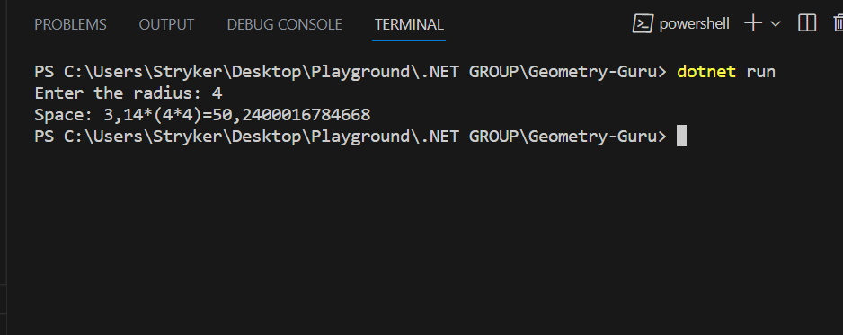

# Geometry-Guru

This project shows how i can successfully use data types&amp;geometric operations

Have a look at `Program.cs` and you can see how I have used :

* Console input/output
* Conversion between data types
* Arithmetic operations

## Demo

